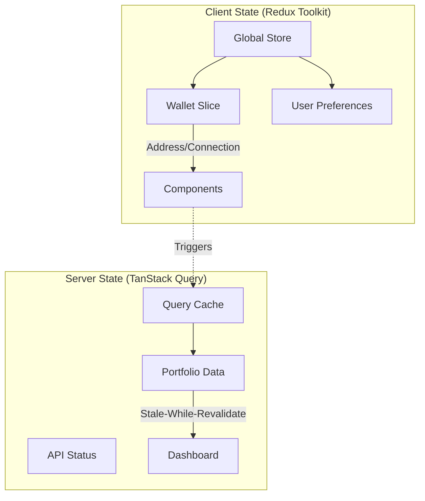
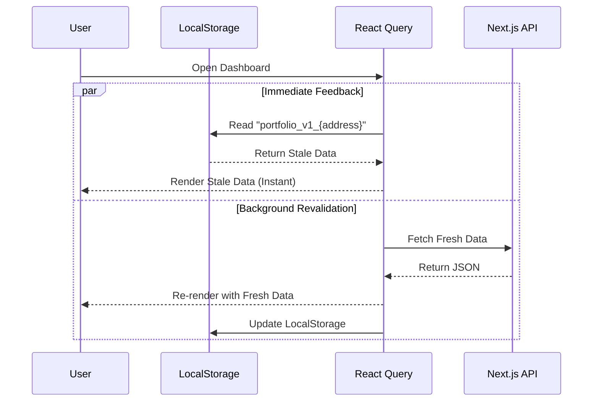

# Multi-Chain RM (Resource Manager)

A high-performance, system-design focused dashboard for aggregating and managing user assets across multiple EVM chains. Built with Next.js 15, tailored for speed, scalability, and seamless multi-chain data integration using the Euclid Protocol.

## System Architecture

The architecture is designed to minimize client-side load while providing real-time data aggregation across fragmented blockchain networks. It leverages an **Aggregator/Proxy Pattern** via Next.js API Routes to interface with the Euclid Protocol's unified liquidity layer.

```mermaid
graph TD
    Client[Client (React/Next.js)] -->|1. Request Portfolio| API[BFF / API Layer]
    subgraph "Backend for Frontend (BFF)"
        API -->|Authentication| Auth[Validate Address]
        API -->|2. Fetch Metadata| GQL[Euclid GraphQL]
    end

    subgraph "Data Layer (Euclid Protocol)"
        GQL -->|3. Get Router State| Router[Router State]
        GQL -->|4. Get Chain Configs| Chains[Chain Registry]
        GQL -->|5. Batch Multicall| VBL[Virtual Balance Layer]
    end

    VBL -->|6. Aggregated Balances| API
    API -->|7. Enriched JSON Response| Client
```

### Data Flow

1.  **Client Initialization**: User connects wallet via `wagmi`/`viem`.
2.  **API Request**: The client calls `/api/user-balances/[address]`.
3.  **Metadata Aggregation**: The server implementation (`route.ts`) fetches the global router state and active EVM chain registry from Euclid.
4.  **Batch Execution**: Instead of querying RPCs individually (n+1 problem), the backend constructs a single **Batch Multicall** query to the Euclid `virtual_balance_address`. This smart contract query iterates through all registered chains and fetches user balances in a single network round-trip.
5.  **Data Normalization**: Token metadata (prices, decimals, logos) is mapped to the raw balance data.
6.  **Client Rendering**: The frontend receives a normalized payload, calculates Net Worth locally to enable instant filtering/sorting without re-fetching.

## State Management Strategy

The application employs a **Hybrid State Architecture**, explicitly separating **Client State** from **Server State** to maximize performance and maintainability.



### 1. Client State (Redux Toolkit)

Used strictly for **synchronous, global UI state** that does not require network validation.

- **Wallet Session**: Manages `address` and `isConnected` status.
- **Benefits**: Zero-latency updates for UI elements (e.g., disconnecting wallet immediately clears the view) without waiting for async promise resolution.

### 2. Server State (TanStack Query)

Used for all **asynchronous data** fetched from the Euclid Protocol.

- **Deduping**: Prevents multiple components from triggering identical API calls.
- **Background Updates**: Automatically refreshes data when the window refocuses.
- **Optimistic UI**: `keepPreviousData` ensures the dashboard remains visible while switching filters or refetching.

## Caching & Performance

To deliver a "native-app-like" feel, we implement a **Double-Layer Caching Strategy** that ensures users _never_ see a loading spinner on repeat visits.



### Layer 1: Memory Cache (TanStack Query)

- **Stale Time**: 1 minute (`60 * 1000ms`). Data is considered fresh for 60 seconds; requests within this window return instantly without hitting the API.
- **Garbage Collection**: Unused data is kept in memory for 5 minutes before disposal.

### Layer 2: Persistent Cache (LocalStorage)

- **Hydration**: On initialization, `usePortfolio` synchronously reads from `localStorage`.
- **Stale-While-Revalidate**: The app immediately renders this persistent data (even if days old) to paint the UI instantly (`initialDataUpdatedAt: 0`), then seamlessly upgrades to fresh data from the server in the background.

## Tech Stack

### Core

- **Framework**: [Next.js 14/15](https://nextjs.org/) (App Router)
- **Runtime**: Bun (Package Manager & Runtime)
- **Language**: TypeScript

### Frontend & UI

- **Styling**: [Tailwind CSS v4](https://tailwindcss.com/)
- **Component Library**: [Radix UI](https://www.radix-ui.com/) (Headless primitives)
- **Animations**: Framer Motion
- **State Management**: Redux Toolkit (Global UI State), React Query (Server State)
- **Web3 Integration**: Wagmi, Viem
- **Visualization**: Recharts

### Backend & Integration

- **API Integration**: GraphQL Request (Euclid Protocol)
- **SDK**: `@euclidprotocol/graphql-codegen`
- **Schema Validation**: Zod

## Key Features

- **Unified Balance Tracking**: View assets across all supported EVM chains in a single view.
- **Server-Side Aggregation**: Heavy lifting of multi-chain queries is handled by the server, reducing client CPU usage and network requests.
- **Real-Time Price Feeds**: Integrated token pricing via protocol metadata.
- **Smart Filtering**: Client-side optimized filtering by Chain, Token Name, or Symbol.
- **Global Net Worth**: Instant calculation of total portfolio value.
- **Responsive Design**: Mobile-first architecture with adaptive layouts (Grid/List views).

## Project Structure

```bash
├── app
│   ├── api/user-balances    # BFF Endpoints for data aggregation
│   ├── dashboard            # Main application view (Protected Route)
│   └── page.tsx             # Landing/Connect page
├── components
│   ├── dashboard            # Dashboard-specific molecular components
│   ├── ui                   # Atomic UI components (Buttons, Inputs, Dialogs)
│   └── wallet               # Wallet connection logic
├── lib
│   ├── store                # Redux store configuration
│   ├── types.ts             # Shared TypeScript interfaces (Chain, Token)
│   └── utils.ts             # Helper functions (Formatters, cn)
└── public                   # Static assets
```

## Getting Started

### Prerequisites

- Node.js 18+ or Bun 1.0+
- Git

### Installation

1.  **Clone the repository**

    ```bash
    git clone https://github.com/yourusername/multi-chain-rm.git
    cd multi-chain-rm
    ```

2.  **Install dependencies**

    ```bash
    bun install
    # or
    npm install
    ```

3.  **Environment Setup**
    Create a `.env.local` file if custom endpoints are needed (defaults are hardcoded for the testnet).

4.  **Run Development Server**

    ```bash
    bun dev
    # or
    npm run dev
    ```

    Open [http://localhost:3000](http://localhost:3000) to view the application.

## Development Notes

- **Performance Optimization**:
  - The dashboard uses `useMemo` extensively to handle filtering and sorting of large token lists on the client side to avoid unnecessary re-renders.
  - The API implements aggressive error handling for individual chains within the batch request to prevent partial failures from crashing the entire dashboard.
